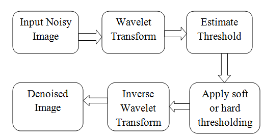

# Wavelet-Based Image Denoising using Thresholding Techniques

This repository contains my project in the [**Digital Image Processing**](https://ece.iisc.ac.in/~rajivs/#/teaching/dip) course, taught by [Rajiv Soundararajan](https://ece.iisc.ac.in/rajiv-soundararajan/) during the Aug-Dec 2025 semester.

## 📌 Overview

This project explores and implements **Wavelet-Based Image Denoising** techniques. It compares the performance of wavelet thresholding methods against standard spatial filtering techniques.

The project is structured to analyze different noise types (Gaussian, Salt & Pepper, Uniform) and evaluates denoising performance using quantitative metrics (PSNR, SSIM, MSE).

**Course/Project ID:** E9 241  
**Contributors:** Tejash More, Dwaipayan Haldar

## 🚀 Features

### 1. Noise Generation (`noiseDist.py`)

The project simulates real-world scenarios by adding various types of noise to input images:

* **Gaussian Noise**: Add the noise following the Gaussian Distribution.
* **Salt & Pepper Noise**: Simulates "on/off" pixel errors.
* **Uniform Noise**: Additive uniform distribution noise.

### 2. Denoising Algorithms



**Wavelet Thresholding Methods (`thresholdingMethod.py`):**

* **VisuShrink**: Universal thresholding.
* [**SUREShrink**](./Papers/SUREShrink.pdf): Adaptive thresholding based on Stein's Unbiased Risk Estimator.
* [**BayesShrink**](./Papers/BAYESShrink.pdf): Data-driven adaptive soft thresholding.

**Spatial Filters (for Comparison in `utilities.py`):**

* **Gaussian Smoothing**
* **Median Smoothing**

### 3. Performance Metrics

* **PSNR** (Peak Signal-to-Noise Ratio)
* **SSIM** (Structural Similarity Index)
* **MSE** (Mean Squared Error)

## 🧠 Methodology

### Wavelet Transform

The project uses the **Discrete Wavelet Transform (DWT)** to decompose the image into frequency sub-bands.

### Thresholding Logic

* **Sigma Estimation:** Noise variance is estimated using the Median Absolute Deviation (MAD) of the HH1 sub-band (implemented in `utilities.get_sigma_est`).
* **Shrinkage:** Coefficients are modified based on the calculated threshold (Soft thresholding logic in `utilities.applyThreshold`).

## 📊 Results

The notebook generates visual and statistical comparisons. Typical results (visualized in the notebook) show:

* **VisuShrink** produces very smooth images but may lose fine details.
* **BayesShrink** often balances noise removal and detail preservation effectively.
* **SUREShrink** adapts well to different image contents.

## 🛠️ Installation & Prerequisites

```bash
pip install numpy matplotlib opencv-python PyWavelets scikit-image
```

## 💻 Usage

1. **Open the Notebook:**

Launch Jupyter Notebook or JupyterLab:

```bash
jupyter notebook E9_241_TejashMore_DwaipayanHaldar_Project_Code.ipynb
```

2. **Run the Analysis:**
    Execute the cells in order. The notebook will:
    * Load images.
    * Add noise using functions from `noiseDist.py`.
    * Apply denoising using `thresholdingMethod.py` and `utilities.py`.
    * Display side-by-side comparisons of Original vs. Noisy vs. Denoised images.
    * Plot PSNR and SSIM comparisons.

## 📂 Files in this Folder

* `main.ipynb`: The main Jupyter Notebook containing all code, analysis, and solutions.
* `src`: Contains the files which has the necessary functions defined. All Function in all the files in this directory gets called in the main file
* `Project_Presentation.pdf`: Presentation which summarizes the whole project.
* `Project_Proposal.pdf`: Initial Project Proposal.
* `dataset`: (dataset) Contains the images which are used for the project.
* `outputImage`: (Result Analysis) Contains the resulting plots and images.
* `Papers`: Contains the research papers which we refer in this project.
* `Problem Statements 5.pdf`: Problem statement for this assignment.
